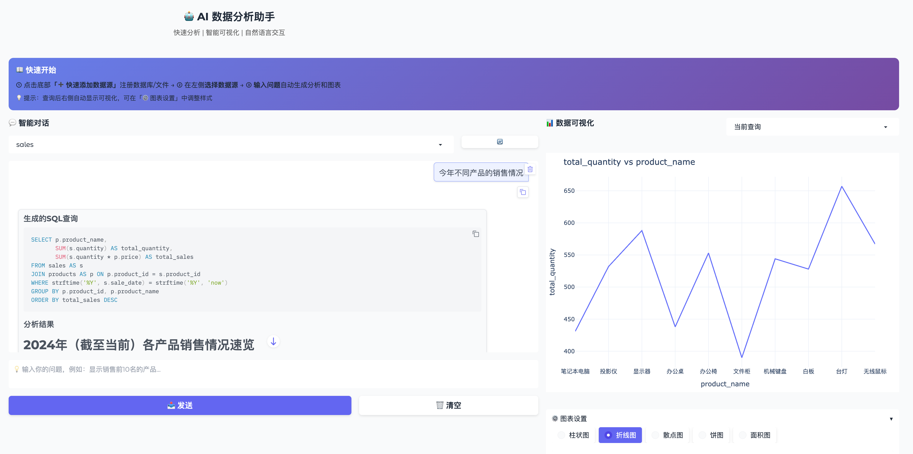

# AI Data Analyst

<div align="center">

🤖 Intelligent Data Analysis Tool Based on Large Language Models

Natural Language Interaction | One-Click Visualization | Multi-source Support

[](https://www.python.org)
[](LICENSE)

English | [中文](README_CN.md)

</div>

---

## 🖼️ Interface Preview



**Minimalist Design - Complete Analysis in 3 Steps**: Add Data Source → Ask Question → Auto-Generate Charts

## ✨ Core Features

- 🗨️ **Natural Language Analysis** - No SQL needed, query data in plain Chinese/English
- 📊 **Auto Visualization** - Query results automatically generate charts, 6 chart types supported
- 🗄️ **Multi-source Support** - SQLite, CSV/Excel, JSON, etc.
- 💬 **Contextual Dialogue** - Multi-turn continuous conversation analysis
- 🔌 **LLM Compatible** - OpenAI, DeepSeek, Qwen, Moonshot, etc.
- 📈 **Query History** - Save query history, switch and review anytime

## ⚡ Key Advantages

- **Zero Learning Curve** - Auto-initialization, built-in operation guide
- **Single-Screen Design** - Chat on left, visualization on right, no tab switching
- **Real-time Preview** - Chart parameter changes take effect instantly
- **Smart Recommendations** - Auto-select best chart type and data columns

<div style="background-color: #f0f7ff; padding: 20px; border-radius: 8px; border-left: 4px solid #0969da;">

## 🚀 Quick Start

```bash
# 1. Clone and enter directory
git clone https://github.com/pengshuang/Awesome-Agent-Projects.git
cd Awesome-Agent-Projects/ai-data-analyst-system

# 2. Install dependencies
pip install -r requirements.txt

# 3. Configure API Key
cp .env.example .env
# Edit .env file to fill in your LLM API Key

# 4. Create sample data (optional)
python data/create_example_db.py

# 5. Launch Web interface
python web_ui.py
# Visit http://localhost:7860
```

</div>

## 📖 Documentation

- [User Guide](docs/USER_GUIDE_EN.md) - For end users
- [Developer Guide](docs/DEVELOPER_GUIDE_EN.md) - For developers

## 💡 Usage Examples

**View Interface Guide**
- Blue card at the top shows 3-step operation process after opening
- Auto-initialization, no manual configuration needed

**Quick Add Data Source**
- Click "➕ Quick Add Data Source" at the bottom
- Select type, fill in name and path

**Natural Language Query**
```
Query top 10 products by sales
```
→ Auto-generate SQL → Execute query → Charts auto-display on right

**View Query History**
- Dropdown in visualization area on right to switch history queries
- Each query auto-saved, review anytime

**Adjust Chart Style**
- Click "⚙️ Chart Settings" to modify chart type and axes
- Changes update in real-time, no generate button needed

## 🛠️ Tech Stack

- **UI Framework**: Gradio 4.x - Single-screen design, auto-initialization
- **LLM Integration**: LlamaIndex - Supports multiple LLM providers
- **Visualization**: Plotly - Interactive charts, real-time updates
- **Data Processing**: Pandas - Efficient data handling
- **Config Management**: Pydantic v2 - Type-safe configuration validation

---

## 📄 License

MIT License
