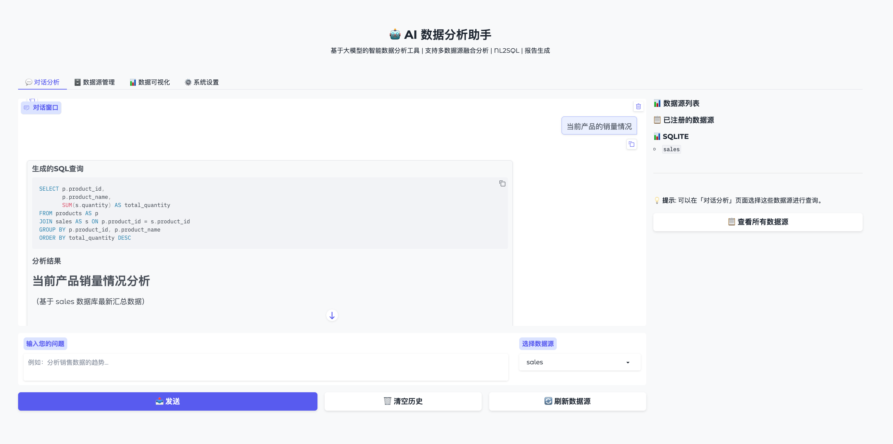
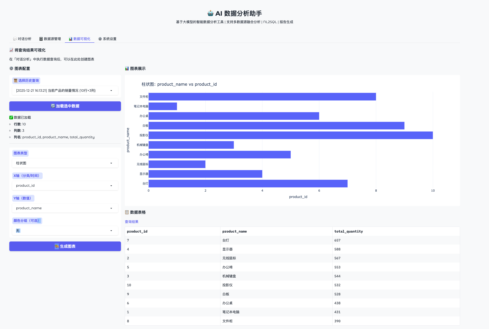

# AI 数据分析助手

<div align="center">

🤖 基于大模型的智能数据分析工具

自然语言交互 | 多数据源支持 | 自动可视化 | 报告生成

[](https://www.python.org)
[](LICENSE)

[English](README.md) | 中文

</div>

---

## 🖼️ 网页交互界面




## ✨ 功能特性

通过自然语言对话，无需编写代码，即可完成：

- 🗄️ **多数据源查询** - SQLite、CSV/Excel、JSON、Parquet
- 🔄 **NL2SQL** - 自然语言自动转换为 SQL
- 📊 **智能可视化** - 自动生成交互式图表
- 💬 **上下文对话** - 连贯的多轮分析对话
- 🔌 **LLM 兼容** - OpenAI、DeepSeek、Qwen 等

## 🚀 快速开始

```bash
# 1. 克隆并进入目录
git clone https://github.com/pengshuang/Awesome-Agent-Projects.git
cd Awesome-Agent-Projects/ai-data-analyst

# 2. 安装依赖
pip install -r requirements.txt

# 3. 配置 API Key
cp .env.example .env
# 编辑 .env 文件，填入你的 LLM API Key

# 4. 创建示例数据（可选）
python data/create_example_db.py

# 5. 启动 Web 界面
python web_ui.py
# 访问 http://localhost:7860
```

## 📖 文档

- [用户使用指南](docs/USER_GUIDE.md) - 面向普通用户
- [开发者指南](docs/DEVELOPER_GUIDE.md) - 面向开发者

## 💡 使用示例

**自然语言查询**
```
查询每个月的销售额趋势
```

**数据分析**
```
分析哪个产品销量最好，给出可视化图表
```

**多轮对话**
```
用户: 查询销售数据
助手: [返回销售数据]
用户: 帮我生成柱状图
助手: [生成可视化图表]
```

## 🛠️ 技术栈

- **框架**: Gradio (Web UI)
- **LLM**: LlamaIndex + OpenAI/DeepSeek/Qwen
- **可视化**: Plotly
- **数据处理**: Pandas

---

## 📄 许可证

MIT License
