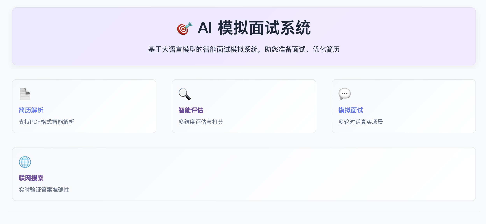
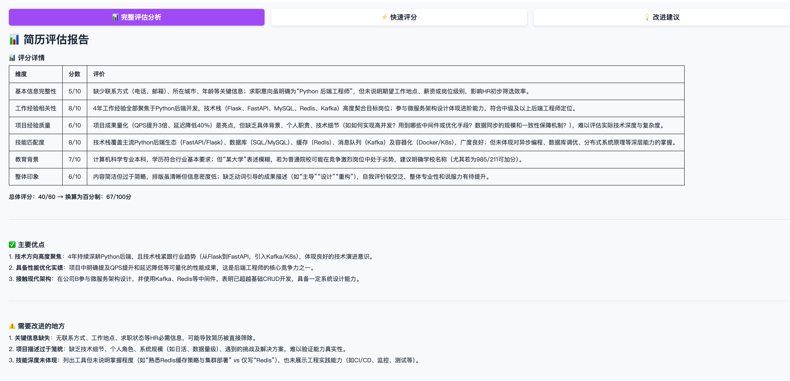
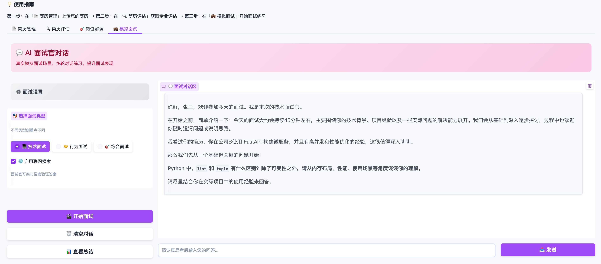

# 🎯 AI Interview Coach System

An intelligent interview assistance system based on Large Language Models (LLM) to help job seekers optimize resumes, prepare for interviews, and improve competitiveness.


[](https://www.python.org/downloads/)
[](https://docs.pydantic.dev/)
[](https://opensource.org/licenses/MIT)

English | [中文](README_CN.md)

## 🖼️ Web UI








## ✨ Core Features

### 📄 Resume Management
- Automatic PDF resume parsing
- Extract and structure resume content
- Data validation and security checks

### 🔍 Resume Evaluation
- 6-dimension quantitative scoring (0-100 points)
- Targeted improvement suggestions
- Job matching analysis

### 💼 Mock Interview
- Technical, behavioral, and comprehensive interviews
- Multi-turn in-depth dialogue based on resume
- Optional web search verification
- Interview data statistics and analysis

### 🤖 Multi-model Support
- OpenAI (GPT-3.5/4)
- DeepSeek
- Alibaba Cloud Qwen
- Other OpenAI-compatible APIs

## 🚀 Quick Start

```bash
# 1. Clone and enter directory
git clone https://github.com/pengshuang/Awesome-Agent-Projects.git
cd Awesome-Agent-Projects/interview-coach

# 2. Install dependencies
pip install -r requirements.txt

# 3. Configure API Key
cp .env.example .env
# Edit .env and fill in your LLM API Key

# 4. Launch Web interface
python web_ui.py
# or: ./start.sh
# Visit http://localhost:7860
```

### Basic Workflow
1. **Upload Resume** → 📄 Resume Management
2. **Evaluate Resume** → 🔍 Resume Evaluation (Complete evaluation/Quick score/Improvement suggestions)
3. **Mock Interview** → 💼 Mock Interview (Select interview type, start dialogue)

For detailed instructions, see: [User Guide](docs/USER_GUIDE_EN.md)

---

## 🛠️ Tech Stack

- **Language**: Python 3.9+
- **LLM**: OpenAI API compatible interface
- **Web UI**: Gradio 4.0+
- **PDF Parsing**: PyMuPDF

---

## 📚 Documentation

- [User Guide](docs/USER_GUIDE_EN.md) - Detailed usage instructions
- [Developer Guide](docs/DEVELOPER_GUIDE_EN.md) - Development documentation

---

## 📄 License

MIT License
