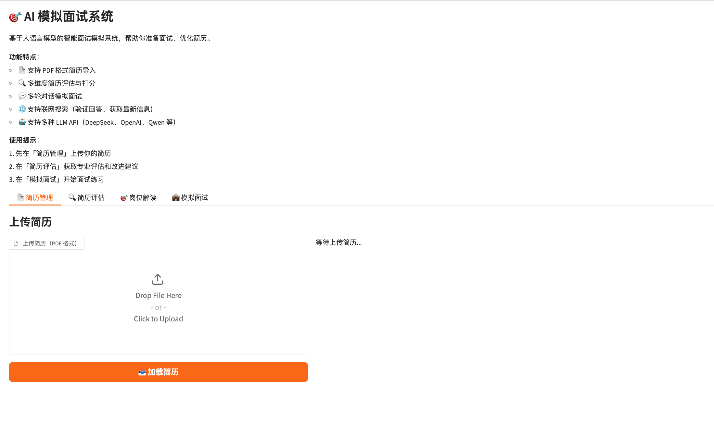
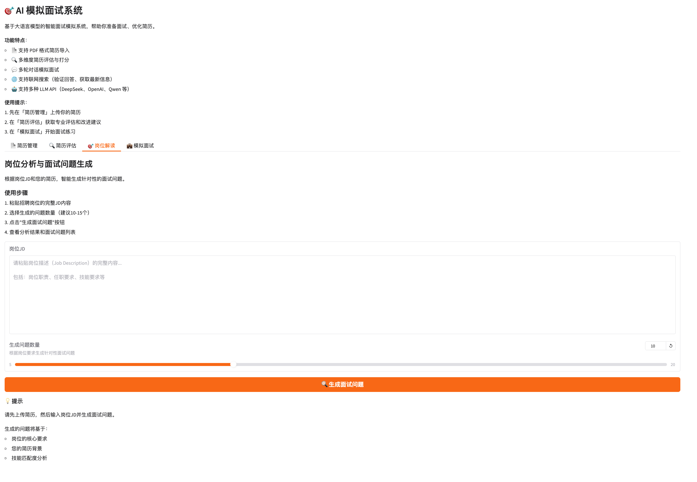

# 🎯 AI 模拟面试系统

基于大语言模型（LLM）的智能面试辅助系统，帮助求职者优化简历、准备面试、提升竞争力。

[](https://www.python.org/downloads/)
[](https://opensource.org/licenses/MIT)

[English](README.md) | 中文

## 🖼️ 网页交互界面




## ✨ 核心功能

### 📄 简历管理
- 自动解析 PDF 格式简历
- 提取并结构化简历内容
- 数据验证和安全检查

### 🔍 简历评估
- 6 维度量化评分（0-100分）
- 针对性改进建议
- 岗位匹配分析

### 💼 模拟面试
- 技术面试、行为面试、综合面试
- 基于简历的多轮深度对话
- 可选联网搜索验证
- 面试数据统计分析

### 🤖 多模型支持
- OpenAI (GPT-3.5/4)
- DeepSeek
- 阿里云通义千问
- 其他 OpenAI 兼容 API

## 🚀 快速开始

```bash
# 1. 克隆并进入目录
git clone https://github.com/pengshuang/Awesome-Agent-Projects.git
cd Awesome-Agent-Projects/interview-coach

# 2. 安装依赖
pip install -r requirements.txt

# 3. 配置 API Key
cp .env.example .env
# 编辑 .env 文件，填入你的 LLM API Key

# 4. 启动 Web 界面
python web_ui.py
# 或：./start.sh
# 访问 http://localhost:7860
```

### 基本流程
1. **上传简历** → 📄 简历管理
2. **评估简历** → 🔍 简历评估（完整评估/快速评分/改进建议）
3. **模拟面试** → 💼 模拟面试（选择面试类型，开始对话）

详细使用说明请查看：[用户指南](docs/USER_GUIDE.md)

---

## 🛠️ 技术栈

- **语言**: Python 3.9+
- **LLM**: OpenAI API 兼容接口
- **Web UI**: Gradio 4.0+
- **PDF 解析**: PyMuPDF

---

## 📚 文档

- [用户指南](docs/USER_GUIDE.md) - 详细使用说明
- [开发指南](docs/DEVELOPER_GUIDE.md) - 开发文档

---

## 📄 许可证

MIT License
