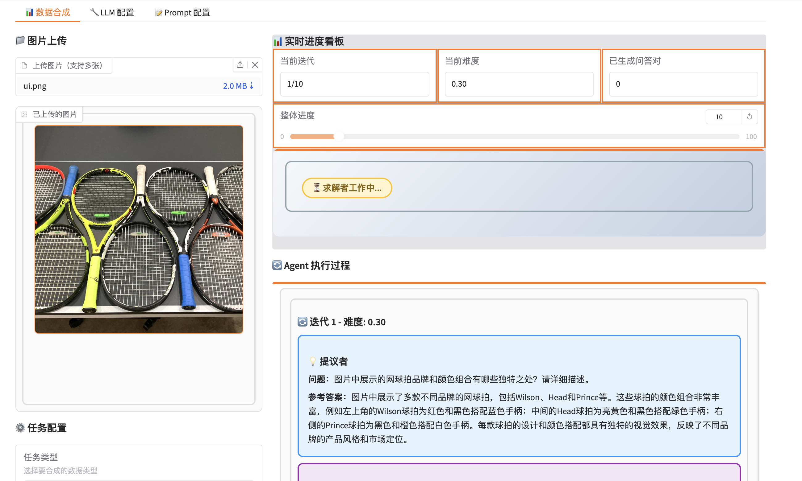

# 多模态数据合成系统

🤖 **基于 Multi-Agent 的高质量多模态训练数据合成平台**

[](https://www.python.org)
[](https://github.com/langchain-ai/langchain)
[](https://github.com/langchain-ai/langgraph)
[](LICENSE)


---

## 📖 项目简介

多模态数据合成系统是一个创新的 AI 数据合成平台，专门用于生成**高质量、高难度**的多模态训练数据，为多模态大模型的 Pretrain 和 SFT 提供支持。

## WEB 界面




### 🎯 核心特性

- **🔄 Iterative Curriculum 机制**：通过渐进式课程设计，让生成的问题从简单到困难逐步升级
- **🤖 三 Agent 协作**：提议者、求解者和验证者三个独立 Agent 协同工作，确保数据质量
- **🎨 多模态支持**：支持基于图片的多种任务类型（描述、问答、推理等）
- **📊 可视化界面**：美观友好的 Web UI，实时展示生成过程
- **⚙️ 灵活配置**：支持自定义 Prompt、LLM 参数和任务类型
- **💾 数据验证**：自动验证生成的问答对质量，只保留高质量数据

### 🌟 解决的核心问题

传统数据合成方法往往生成的数据**过于简单**，无法满足大模型训练需求。本系统通过：

1. **渐进式难度提升**：从简单问题开始，每次迭代增加难度
2. **历史感知生成**：基于已生成的问题，确保新问题更难、更新颖
3. **三重验证机制**：提议、求解、验证三步走，确保数据质量

---

## 🏗️ 系统架构

```
┌─────────────────────────────────────────────────────────┐
│                      Web UI (Gradio)                    │
│  • 图片上传  • 任务配置  • 实时可视化  • 结果导出      │
└────────────────────┬────────────────────────────────────┘
                     │
┌────────────────────▼────────────────────────────────────┐
│              LangGraph Workflow Engine                  │
│                                                         │
│  ┌─────────────┐  ┌─────────────┐  ┌─────────────┐   │
│  │   提议者     │→ │   求解者     │→ │   验证者     │   │
│  │  Proposer   │  │   Solver    │  │  Validator  │   │
│  └─────────────┘  └─────────────┘  └─────────────┘   │
│         │                 │                 │          │
│         └─────────────────┴─────────────────┘          │
│                  Iterative Curriculum                   │
│            (历史问答对 → 难度递增 → 新问题)              │
└────────────────────┬────────────────────────────────────┘
                     │
┌────────────────────▼────────────────────────────────────┐
│              Multimodal LLM (API)                       │
│        • OpenAI Vision API  • Qwen-VL  • 自定义         │
└─────────────────────────────────────────────────────────┘
```

### 📝 工作流程

```
开始
  ↓
[上传图片 + 配置任务]
  ↓
┌─────── 迭代循环 ────────┐
│                        │
│ 1️⃣ 提议者生成新问答对    │
│    • 基于图片内容       │
│    • 基于历史问答       │
│    • 难度递增策略       │
│         ↓              │
│ 2️⃣ 求解者尝试回答       │
│    • 基于图片理解       │
│    • 生成预测答案       │
│         ↓              │
│ 3️⃣ 验证者评估质量       │
│    • 对比参考答案       │
│    • 计算相似度         │
│    • 判断是否通过       │
│         ↓              │
│ ✅ 通过 → 加入历史缓冲区  │
│ ❌ 失败 → 丢弃          │
│         ↓              │
│ [难度 +0.1]           │
│         ↓              │
└────── 下一轮迭代 ───────┘
  ↓
[导出 JSON 数据集]
  ↓
结束
```

---

## 🚀 快速开始

### 环境要求

- Python 3.8+
- pip 或 conda

### 安装步骤

1. **克隆项目**

```bash
cd /Users/pengshuang/Awesome-Agent-Projects/multimodal-data-synthesis-system
```

2. **初始化系统**

```bash
python init_system.py
```

3. **配置环境变量**

编辑 `.env` 文件：

```bash
OPENAI_API_KEY=your_api_key_here
OPENAI_BASE_URL=https://api.openai.com/v1
LLM_MODEL_NAME=gpt-4-vision-preview
```

4. **安装依赖**

```bash
pip install -r requirements.txt
```

5. **启动系统**

```bash
bash start.sh
# 或
python web_ui.py
```

6. **访问界面**

打开浏览器访问：`http://localhost:7860`

---

## 💡 使用示例

### 1. 图片问答类任务

```python
# 上传一张图片
# 选择任务类型：图片问答类
# 设置：最大迭代 10 次，初始难度 0.3，难度递增 0.1

# 生成结果示例：
# 问题1 (难度0.3): 图片中有什么物体？
# 问题2 (难度0.4): 图片中的人物在做什么动作？
# 问题3 (难度0.5): 根据场景推断，这可能是什么时间段？
# ...
# 问题10 (难度1.0): 分析图片中的光影关系和构图技巧
```

### 2. 多图比较类任务

```python
# 上传多张图片
# 选择任务类型：多图比较类
# 添加描述：比较不同场景的异同点

# 系统会生成跨图片的比较问题
```

---

## 📊 数据格式

生成的数据集格式（JSON）：

```json
{
  "task_id": "task_20260101_120000",
  "task_type": "图片问答类",
  "images": [
    {
      "path": "/path/to/image.jpg",
      "filename": "image.jpg"
    }
  ],
  "qa_pairs": [
    {
      "question": "图片中的主要物体是什么？",
      "answer": "一只黄色的猫",
      "difficulty": 0.3,
      "iteration": 1,
      "created_at": "2026-01-01T12:00:00"
    },
    {
      "question": "这只猫的表情和姿态暗示了什么情绪状态？",
      "answer": "猫呈现出放松和满足的状态，微眯的眼睛和舒展的身体表明它感到安全和舒适",
      "difficulty": 0.8,
      "iteration": 6,
      "created_at": "2026-01-01T12:05:00"
    }
  ],
  "total_iterations": 10,
  "valid_qa_count": 8
}
```

---

## 🛠️ 技术栈

- **核心框架**：LangChain + LangGraph
- **多模态 LLM**：OpenAI Vision API / Qwen-VL
- **数据验证**：Pydantic
- **Web 界面**：Gradio
- **图片处理**：Pillow

---

## 📚 文档导航

- **[用户指南](docs/USER_GUIDE.md)** - 详细的使用说明
- **[开发指南](docs/DEVELOPER_GUIDE.md)** - 二次开发文档
- **[架构设计](docs/ARCHITECTURE.md)** - 系统架构详解

---

## 🤝 贡献指南

欢迎提交 Issue 和 Pull Request！

---

## 📄 开源协议

本项目采用 [MIT License](LICENSE) 开源协议。

---

## 🙏 致谢

- 参考项目：[multi-agent-data-synthesis-system](../multi-agent-data-synthesis-system)
- 技术支持：LangChain、LangGraph 社区

---

**如果这个项目对你有帮助，请给一个 ⭐️ Star！**

