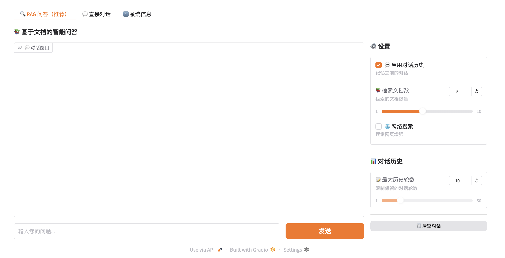

# 📚 学术论文智能问答系统

> 基于 RAG 技术的智能论文阅读助手，支持多轮对话、Web UI、联网搜索，让您轻松理解学术论文

[](https://www.python.org/downloads/)
[](https://www.llamaindex.ai/)

[English](README.md) | 中文

---

## 📖 文档导航

| 文档 | 说明 |
|------|------|
| [README_CN.md](README_CN.md) | **项目介绍 & 快速开始** |
| [docs/USER_GUIDE.md](docs/USER_GUIDE.md) | **使用指南**（配置、界面使用、常见问题） |
| [docs/DEVELOPER_GUIDE.md](docs/DEVELOPER_GUIDE.md) | **开发指南**（架构、API） |

---

## 🖼️ 网页交互界面



---

## 🌟 核心特性

- 💬 **多轮对话** - 上下文记忆，连续追问
- 🧠 **RAG 问答** - 基于向量检索的精准回答
- 🌐 **Web UI** - 美观易用，支持 Markdown 渲染
- 📄 **多格式** - PDF、DOCX、Markdown、TXT
- 🔍 **语义检索** - 向量数据库，毫秒级响应
- 📊 **来源追溯** - 答案标注原文出处
- 🌐 **联网搜索** - DuckDuckGo 获取最新信息

---

## 🚀 快速开始

```bash
# 1. 克隆并进入目录
git clone https://github.com/pengshuang/Awesome-Agent-Projects.git
cd Awesome-Agent-Projects/academic-paper-qa

# 2. 安装依赖
pip install -r requirements.txt

# 3. 配置 API Key
cp .env.example .env
# 编辑 .env 文件，填入你的 LLM API Key

# 4. 启动 Web UI
./start_web_multi.sh
# 或：python web_ui_multi_turn.py
# 访问 http://127.0.0.1:7860
```

**首次使用**：将论文（PDF/DOCX/TXT）放入 `data/documents/` 文件夹，然后在 Web UI 中构建索引。

---

## 💡 使用示例

### 添加文档并提问

```bash
# 1. 添加论文
cp paper.pdf ./data/documents/

# 2. 启动 Web UI
./start_web_multi.sh

# 3. 构建索引 → 开始提问
```

### 对话示例

```
👤: 这篇论文的主要贡献是什么？
🤖: 主要贡献是提出了 Transformer 架构...

👤: 它解决了什么问题？
🤖: Transformer 解决了 RNN 的序列依赖问题...
```

详细使用说明：[使用指南](docs/USER_GUIDE.md)

---

## 🛠️ 技术栈

- **RAG 框架**: LlamaIndex
- **向量数据库**: Chroma
- **Embedding**: BAAI/bge-small-zh-v1.5
- **LLM**: OpenAI / DeepSeek / Moonshot
- **Web UI**: Gradio 4.0+

---

## ❓ 常见问题

**Q: 支持哪些文件格式？**  
A: PDF、DOCX、Markdown、TXT

**Q: 需要 GPU 吗？**  
A: 不需要，CPU 即可运行

**Q: 支持本地模型吗？**  
A: Embedding 支持本地模型，LLM 需要 API

**Q: 如何调整历史轮数？**  
A: 参见 [使用指南 - 历史轮数控制](docs/USER_GUIDE.md#历史轮数控制)

**Q: 一次可以加载多少篇论文？**  
A: 理论上无限制，实际受限于内存。测试过 100+ 篇论文，性能良好。

更多问题：[使用指南 - 问题排查](docs/USER_GUIDE.md#问题排查)

---

## 📄 许可证

MIT License
